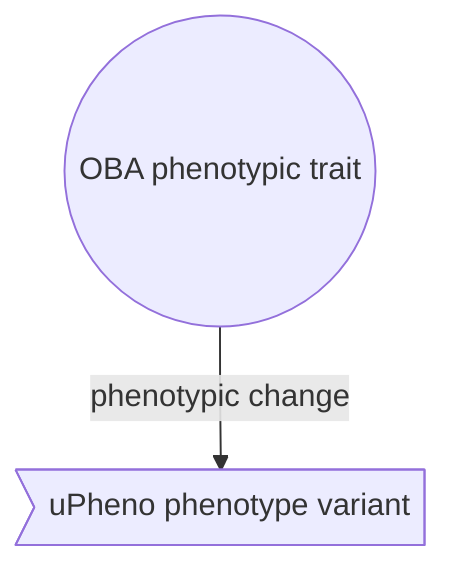

# data_visualisation
Data visualisation

```mermaid
graph TB
%% define node labels
oba((OBA phenotypic trait))
upheno>uPheno phenotype variant]
%% define graph structure
oba -->|phenotypic change| upheno
%% actions - links
click oba "https://www.ebi.ac.uk/ols/ontologies/oba"
click upheno ""https://ols.monarchinitiative.org/ontologies/upheno2
```
